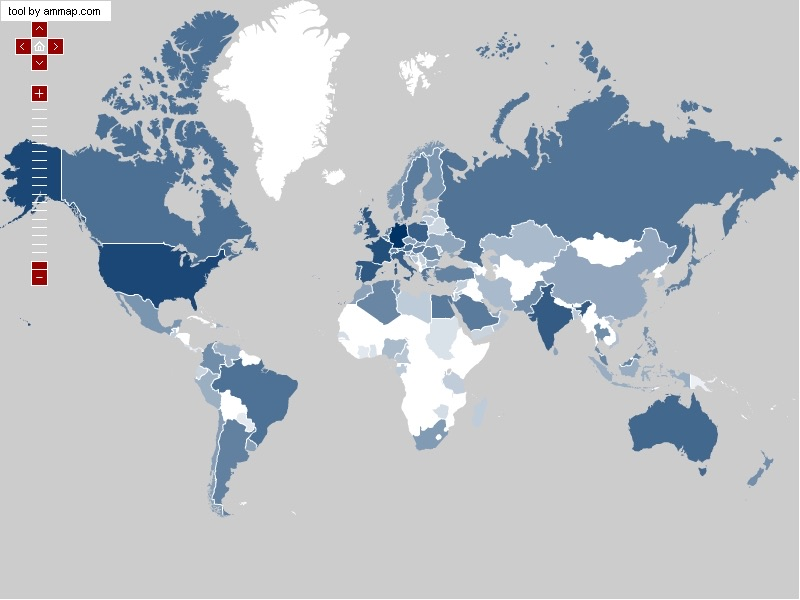

## The Short Story

The goal was to reliably find problems in the network and raise alerts about
them. As a user, you want to know you are getting the service you pay for, and
to be told quickly when something breaks — particularly when an interruption
might entitle you to compensation. For an ISP, the same information localizes
and identifies faults faster, so they can be fixed before they generate
complaints.

NEWS did this by passively monitoring BitTorrent performance and watching for
changes that suggested network trouble. Because a problem can be anywhere,
including inside your own home network, NEWS corroborated across multiple users
in the same area — the same ISP, or the same country. When enough people saw the
same problem in the same place, it raised an alarm.

The approach's virtue was its cost: monitoring traffic the client was generating
anyway made detection extremely lightweight.

*NEWS coverage. Detection depended on having enough users inside the same ISP or
country to corroborate a suspected problem.*

## Why the Edge

The Internet increasingly carried services — VoIP, content distribution, IPTV —
whose user experience had become a benchmark for providers and users alike. That
experience is largely determined by the frequency, duration and severity of
network events, so there is a clear need to detect, isolate and explain those
events quickly.

Most prior work monitored core networks or probed from research and education
networks. That is effective for faults affecting many customers at once, but it
misses silent failures — incompatible QoS or ACL settings, for instance — and
their effect on individual services. End-to-end monitoring approaches, meanwhile,
required active measurement that does not scale to the number of elements at the
network's edge.

NEWS took the other route: push performance monitoring and detection onto the
end systems themselves. Crowdsourcing the monitoring meant participating hosts
could collectively handle the data volume needed for real-time detection at the
scale of millions of monitors, and installing inside or alongside a service
allowed immediate, incremental deployment.

## Distribution

NEWS installed into the Vuze/Azureus BitTorrent client and reached **hundreds of
thousands of users**. It was **released under the GPL**, with source included in
the jar. Users contributed translations. It is no longer available.



- **24 Oct 2008** — a Java-version problem affecting macOS identified, fix planned for the next release
- **1 Jul 2008** — version 0.8 mainlined, with numerous bug fixes
- **24 Jun 2008** — version 0.6 released as a signed plugin for beta testing at scale
- **19 May 2008** — version 0.2, mature enough for general use
- **7 May 2008** — first version released



---

## Papers

- [Crowdsourcing Service-Level Network Event Detection]() — SIGCOMM 2010
- [Using the Crowd to Monitor the Cloud: Detecting Network Events from Edge Systems]() — Northwestern EECS technical report, 2009

---

## Coverage

NEWS was covered by RedOrbit, Slashdot, and *The Hindu* in 2008.

---

## People

**Lead & PI**

- [Fabián E. Bustamante]() (Northwestern University)

**Students**

- [David R. Choffnes]()

---

## Related Links

- [Measurement and Experimentation from the Edge]() — the wider thread this belongs to
- [Dasu]() — the platform that grew out of the same approach

